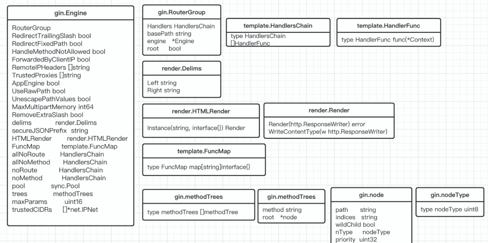

# Gin

https://github.com/gin-gonic/gin

### Gin

> `Gin` is a `Web` framework written in `Golang`, a routing based on `Radix` tree, small memory footprint, no reflection, predictable `API` framework, the speed is nearly 40 times higher, support Middleware, routing group processing, JSON and other multi-mode validation, built-in `JSON`, `XML`, `HTML` and other rendering. It is an easy-to-use `API` framework; this series of articles will specifically reveal the source code of `Gin`. Please see an example below:


```go
func main() {
	// init a rounter
	r := gin.New()

	// global middleware
  // Logger: into gin.DefaultWriter
	// By default gin.DefaultWriter = os.Stdout
	r.Use(gin.Logger())

  // Recovery: recover any panic。Will be 500。
	r.Use(gin.Recovery())

	r.GET("/benchmark", MyBenchLogger(), benchEndpoint)

	// authorized := r.Group("/", AuthRequired())
	authorized := r.Group("/")

        // AuthRequired() 
	authorized.Use(AuthRequired())
	{
		authorized.POST("/login", loginEndpoint)
		authorized.POST("/submit", submitEndpoint)
		authorized.POST("/read", readEndpoint)

		testing := authorized.Group("testing")
		testing.GET("/analytics", analyticsEndpoint)
	}

	r.Run(":8080")
}
```


### Engine 

> The following figure describes the entire `Engine` related structure combination; `gin.Engine` is a container object, which is the basis of the entire framework; `gin.RouterGroup` is responsible for storing all middleware, including request paths; `gin.trees `Responsible for storing the mapping between routes and `handle` methods, using the `Radix` tree structure; the following will focus on a brief description of `Engine` parameters; other parts will be analyzed in subsequent series of articles.




```
RouterGroup
```

> Responsible for storing all middleware, including request paths.

```
RedirectTrailingSlash
```

> Whether to enable redirection requests for routes with the suffix /, such as requesting /foo/ but only /foo routes exist, the client uses http status 307 to redirect to /foo for requests

```
RedirectFixedPath
```

> If this parameter is enabled, the router will try to fix the current request address by itself when no handler is registered.
> 1. The first redundant element will be deleted (../ or //);
> 2. Then the routing will perform a case-insensitive lookup on the new path;
> 3. If the corresponding handler can be found normally, the route will be redirected to the correct handler and return 301 or 307. (For example: users visiting /FOO and /..//Foo may be redirected to /foo on the route)

```
HandleMethodNotAllowed
```

> Check if the current path allows routing using other request methods.

```
ForwardedByClientIP
```

> Whether to forward the client ip.

```
Remote IP Headers
```

> Obtain the client IP in the following cases. ForwardedByClientIP is true; context.Request.RemoteAddr has a value

```
Trusted Proxies
```

> Network origin list (IPv4 address, IPv4 CIDR, IPv6 address or trust IPv6 CIDR of a request header containing: when `(*gin.Engine).ForwardedByClientIP` is `true`.

```
App Engine
```

> If enabled, a header starting with "X-AppEngine..." will be added to the request.

```
UseRawPath
```

> If enabled, url.RawPath will be used to find parameters

```
UnescapePathValues
```

> If true, path values will not be escaped. If UseRawPath is false (which is the default), UnescapePathValues is actually true, as url.Path will be used, which has been escaped.

```
MaxMultipartMemory
```

> The value assigned to the 'maxMemory' parameter of ParseMultipartForm of http.Request.

```
RemoveExtraSlash
```

> Whether to remove extra backslashes (requests with extra slashes can be parsed at the beginning)

```
delims
```

> Delims represent a set of left and right delimiters for HTML template rendering.

```
secureJSONPrefix
```

> Set the json prefix in Context.SecureJSON China

```
HTMLRender
```

> Return HTMLRender interface (used to render HTMLProduction and HTMLDebug structure type templates)

```
FuncMap
```

> FuncMap map[string]interface{} in the html/template package, used to define the mapping from names to functions.

```
allNoRoute
```

> Make a copy of the global `handlers`, add `NoRoute` processing method

```
allNoMethod
```

> Make a copy of the global `handlers`, add the `NoMethod` processing method

```
noRoute
```

> noRoute adds a handler for NoRoute. It returns 404 code by default

```
noMethod
```

> noMethod adds a handler for NoMethod, which returns a 405 code by default

```
pool
```

> Mainly used to store `context` context object, used to optimize performance when processing `http` requests

```
trees
```

> Responsible for storing the mapping of routes and handle methods, using the Radix tree structure.

```
maxParams
```

> When allocating `context`, initialize the slice length of the parameter `Params`

```
trustedCIDRs
```

> IP network address pointer slice


### Handler request

#### Init Gin instance

> The `Gin` framework exposes two methods for initializing `Gin` instances, the `New` and `Default` methods. The difference between the two is that the `Default` method adds the use of `Logger` and `Recovery` comes with middleware processing. If you need to write these two middleware by yourself, you can add the `Use` method on the basis of calling `New` to register the middleware. Two core functions are mainly implemented in the initialization of the `Gin` instance: the initialization of the routing group `RouterGroup` and the initialization of the `pool` are mainly used to store the `context` context object, which is used to optimize the performance of `http` request processing.

```go
// return Engine
func New() *Engine {
	debugPrintWARNINGNew()
	engine := &Engine{
		RouterGroup: RouterGroup{ //init RouterGroup
			Handlers: nil,
			basePath: "/",
			root:     true,
		},
		FuncMap:                template.FuncMap{},
		RedirectTrailingSlash:  true,
		RedirectFixedPath:      false,
		HandleMethodNotAllowed: false,
		ForwardedByClientIP:    true,
		RemoteIPHeaders:        []string{"X-Forwarded-For", "X-Real-IP"},
		TrustedProxies:         []string{"0.0.0.0/0"},
		AppEngine:              defaultAppEngine,
		UseRawPath:             false,
		RemoveExtraSlash:       false,
		UnescapePathValues:     true,
		MaxMultipartMemory:     defaultMultipartMemory,
		trees:                  make(methodTrees, 0, 9), //init router tree
		delims:                 render.Delims{Left: "{{", Right: "}}"},
		secureJSONPrefix:       "while(1);",
	}
	engine.RouterGroup.engine = engine
	engine.pool.New = func() interface{} {  //init Pool
		return engine.allocateContext()
	}
	return engine
}

func Default() *Engine {
	debugPrintWARNINGDefault()
	engine := New()
	engine.Use(Logger(), Recovery())
	return engine
}
```

#### Register Middleware

> There are mainly two kinds of middleware in `Gin` framework: global middleware and routing group middleware.

- `Global Middleware`: Write records to `RouterGroup.Handlers` by calling `Gin.Use()`

```go
func (engine *Engine) Use(middleware ...HandlerFunc) IRoutes {
	engine.RouterGroup.Use(middleware...)
	engine.rebuild404Handlers()
	engine.rebuild405Handlers()
	return engine
}
func (group *RouterGroup) Use(middleware ...HandlerFunc) IRoutes {
	group.Handlers = append(group.Handlers, middleware...)
	return group.returnObj()
}
```

- `Router Group Middleware`: Return a newly generated `RouterGroup` pointer through `RouterGroup.Group`, which is used to separate each routing group to load different middleware. Note that `group.combineHandlers(handlers)` will copy a copy of the global middleware to the newly generated `RouterGroup`.

```go
func (group *RouterGroup) Group(relativePath string, handlers ...HandlerFunc) *RouterGroup {
	return &RouterGroup{
		Handlers: group.combineHandlers(handlers),
		basePath: group.calculateAbsolutePath(relativePath),
		engine:   group.engine,
	}
}
```

#### Router

> Several methods for registering routes are specified in the `Gin` framework: `GET`, `POST`, `DELETE`, `PUT`, `HEAD`, `OPTIONS`, `ANY`, `PATCH`. Regardless of the request method, `RouterGroup.handler` will be called to add routes. In this method, `group.combineHandlers(handlers)` will also copy a copy of the global middleware and add the `handlers` of the corresponding route. Form a `List` into the tree nodes, and finally call `tree.addRoute` to add nodes.

```go
func (group *RouterGroup) POST(relativePath string, handlers ...HandlerFunc) IRoutes {
	return group.handle(http.MethodPost, relativePath, handlers)
}
func (group *RouterGroup) GET(relativePath string, handlers ...HandlerFunc) IRoutes {
	return group.handle(http.MethodGet, relativePath, handlers)
}
func (group *RouterGroup) DELETE(relativePath string, handlers ...HandlerFunc) IRoutes {
	return group.handle(http.MethodDelete, relativePath, handlers)
}
func (group *RouterGroup) PATCH(relativePath string, handlers ...HandlerFunc) IRoutes {
	return group.handle(http.MethodPatch, relativePath, handlers)
}
func (group *RouterGroup) PUT(relativePath string, handlers ...HandlerFunc) IRoutes {
	return group.handle(http.MethodPut, relativePath, handlers)
}
func (group *RouterGroup) OPTIONS(relativePath string, handlers ...HandlerFunc) IRoutes {
	return group.handle(http.MethodOptions, relativePath, handlers)
}
func (group *RouterGroup) HEAD(relativePath string, handlers ...HandlerFunc) IRoutes {
	return group.handle(http.MethodHead, relativePath, handlers)
}
func (group *RouterGroup) Any(relativePath string, handlers ...HandlerFunc) IRoutes {
	group.handle(http.MethodGet, relativePath, handlers)
	group.handle(http.MethodPost, relativePath, handlers)
	group.handle(http.MethodPut, relativePath, handlers)
	group.handle(http.MethodPatch, relativePath, handlers)
	group.handle(http.MethodHead, relativePath, handlers)
	group.handle(http.MethodOptions, relativePath, handlers)
	group.handle(http.MethodDelete, relativePath, handlers)
	group.handle(http.MethodConnect, relativePath, handlers)
	group.handle(http.MethodTrace, relativePath, handlers)
	return group.returnObj()
}
func (group *RouterGroup) handle(httpMethod, relativePath string, handlers HandlersChain) IRoutes {
	absolutePath := group.calculateAbsolutePath(relativePath)
	handlers = group.combineHandlers(handlers)
	group.engine.addRoute(httpMethod, absolutePath, handlers)
	return group.returnObj()
}
func (engine *Engine) addRoute(method, path string, handlers HandlersChain) {
	assert1(path[0] == '/', "path must begin with '/'")
	assert1(method != "", "HTTP method can not be empty")
	assert1(len(handlers) > 0, "there must be at least one handler")

	debugPrintRoute(method, path, handlers)

	root := engine.trees.get(method)
	if root == nil {
		root = new(node)
		root.fullPath = "/"
		engine.trees = append(engine.trees, methodTree{method: method, root: root})
	}
	root.addRoute(path, handlers)

	if paramsCount := countParams(path); paramsCount > engine.maxParams {
		engine.maxParams = paramsCount
	}
}
```

#### Start

- `HTTP`

```go
func (engine *Engine) Run(addr ...string) (err error) {
	defer func() { debugPrintError(err) }()

	trustedCIDRs, err := engine.prepareTrustedCIDRs()
	if err != nil {
		return err
	}
	engine.trustedCIDRs = trustedCIDRs
	address := resolveAddress(addr)
	debugPrint("Listening and serving HTTP on %s\n", address)
	err = http.ListenAndServe(address, engine)
	return
}
```

- `HTTPS`

```go
func (engine *Engine) RunTLS(addr, certFile, keyFile string) (err error) {
	debugPrint("Listening and serving HTTPS on %s\n", addr)
	defer func() { debugPrintError(err) }()
	err = http.ListenAndServeTLS(addr, certFile, keyFile, engine)
	return
}
```

- `Unix Socket`

```go
func (engine *Engine) RunUnix(file string) (err error) {
	debugPrint("Listening and serving HTTP on unix:/%s", file)
	defer func() { debugPrintError(err) }()

	listener, err := net.Listen("unix", file)
	if err != nil {
		return
	}
	defer listener.Close()
	defer os.Remove(file)

	err = http.Serve(listener, engine)
	return
}
```

- `File`

```go
func (engine *Engine) RunFd(fd int) (err error) {
	debugPrint("Listening and serving HTTP on fd@%d", fd)
	defer func() { debugPrintError(err) }()

	f := os.NewFile(uintptr(fd), fmt.Sprintf("fd@%d", fd))
	listener, err := net.FileListener(f)
	if err != nil {
		return
	}
	defer listener.Close()
	err = engine.RunListener(listener)
	return
}
```

#### Handler request

```go
func (engine *Engine) ServeHTTP(w http.ResponseWriter, req *http.Request) {
	c := engine.pool.Get().(*Context)
	c.writermem.reset(w)
	c.Request = req
	c.reset()

	engine.handleHTTPRequest(c)

	engine.pool.Put(c)
}

func (engine *Engine) handleHTTPRequest(c *Context) {
	httpMethod := c.Request.Method //http请求方法，get、post
	rPath := c.Request.URL.Path //path
	unescape := false
	if engine.UseRawPath && len(c.Request.URL.RawPath) > 0 {
		rPath = c.Request.URL.RawPath
		unescape = engine.UnescapePathValues
	}

	if engine.RemoveExtraSlash {
		rPath = cleanPath(rPath)
	}

	// scan httpMethod node in tree
	t := engine.trees
	for i, tl := 0, len(t); i < tl; i++ {
		if t[i].method != httpMethod { 
			continue
		}
		root := t[i].root
		// find path
		value := root.getValue(rPath, c.params, unescape)
		if value.params != nil {
			c.Params = *value.params //Params
		}
		if value.handlers != nil {
			c.handlers = value.handlers //handlers
			c.fullPath = value.fullPath //fullPath
			c.Next() 
			c.writermem.WriteHeaderNow() 
			return
		}
                
		if httpMethod != "CONNECT" && rPath != "/" {
			if value.tsr && engine.RedirectTrailingSlash {
				redirectTrailingSlash(c) 
				return
			}
			if engine.RedirectFixedPath && redirectFixedPath(c, root, engine.RedirectFixedPath) {
				return
			}
		}
		break
	}

	if engine.HandleMethodNotAllowed {
		for _, tree := range engine.trees {
			if tree.method == httpMethod {
				continue
			}

			if value := tree.root.getValue(rPath, nil, unescape); value.handlers != nil {
				c.handlers = engine.allNoMethod
				serveError(c, http.StatusMethodNotAllowed, default405Body)
				return
			}
		}
	}
        // http code = 404
	c.handlers = engine.allNoRoute
	serveError(c, http.StatusNotFound, default404Body)
}
```