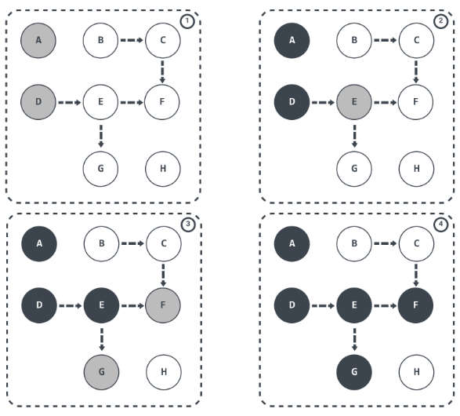
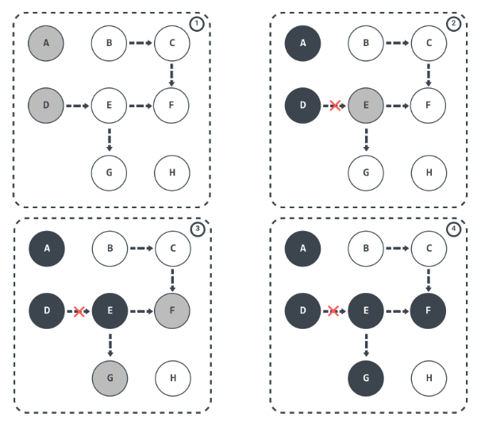
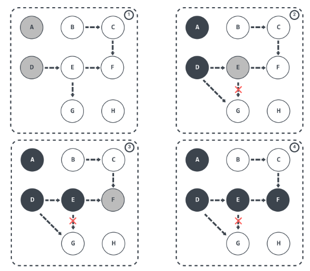
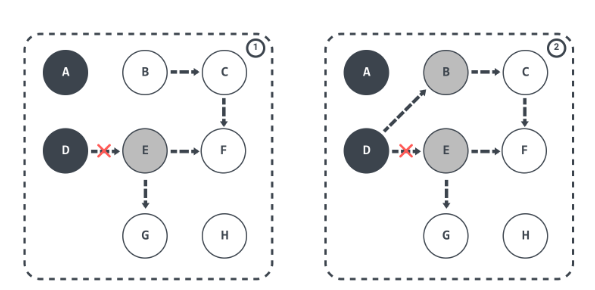
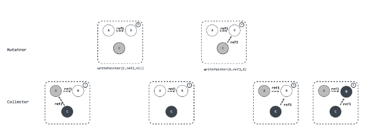

# GC

### **tricolor mark-and-sweep algorithm**

****


The three-color  method divides the color of the object into three colors: black, gray, and white.

1. Black: The object has been marked, and all the attributes under the object have been marked (the object required by the program); Black object is save and should stay.
2. Gray: The object has been marked, but the properties under the object have not been marked (the GC needs to find garbage from this object);
3. White: the object has not been marked (object garbage);

When the garbage collector starts working, the traversal visit starts from GC Roots, and the visit steps can be divided into the following steps:

**GC Roots root objects will be marked in gray**;
Then get the object from the gray collection, mark it black, and mark the object that this object references to as gray;
Repeat step 2 until there are no gray sets to mark;
After the end, the remaining unmarked white objects are unreachable by GC Roots and can be recycled.
The process is roughly as follows:



### Problems

#### More Garabge

Assuming that E has been marked (turned gray), D and E have broken the reference at this time. It is reasonable to say that the object E/F/G should be recycled, but because E has turned gray, it will still be It is regarded as a living object and continues to traverse. The final result is: this part of the object will still be marked as alive, that is, the current round of GC will not reclaim this part of memory.

This part of the memory that should have been reclaimed but not reclaimed is called "floating garbage". The process is shown in the figure below:





In addition to the problem of multiple labels above, there is also the problem of missing labels. When the GC thread has traversed until E becomes gray and D becomes black, gray E disconnects reference to white G, and black D references white G. At this time, switch back to the GC thread and continue running, because E has no reference to G, so G will not be placed in the gray set. Although G is re-referenced by D, because D is already black, the traversal process will not be re-traversed.

The final result is: G will always stay in the white set, and finally be cleared as garbage. This directly affects the correctness of the application, which is unacceptable, and this is also a problem that Go needs to solve during GC.



### Memory Barrier

A **memory barrier**, is a type of barrier instruction that causes a central processing unit (CPU) or compiler to enforce an ordering constraint on memoryoperations issued before and after the barrier instruction. This typically means that operations issued prior to the barrier are guaranteed to be performed before operations issued after the barrier.

Then in order to ensure correctness in the marking algorithm, then we need to meet any of the following conditions:

- Strong tri-color invariant: black objects will not point to white objects, only gray objects or black objects;

- Weak tri-color invariant: Even if a black object points to a white object, starting from the gray object, there is always a path to find the white object;

According to the different types of operations, we can divide the memory barrier into two types: Read barrier and Write barrier. In Go, both use Write barrier. The reason is also in "Uniprocessor Garbage Collection Techniques". mentioned:

If a non copying collector is used the use of a read barrier is an unnecessary expense. there is no need to protect the mutator from seeing an invalid version of a pointer. Write barrier techniques are cheaper, because heap writes are several times less common than heap reads

For a garbage collector that does not need object copying, the Read barrier (read barrier) is very expensive, because for this type of garbage collector, it is not necessary to save the version pointer problem of the read operation. Relatively speaking, the Write barrier (write barrier) code is smaller, because the write operation in the heap is much smaller than the read operation in the heap.

Let's take a look at how the Write barrier (write barrier) does this.

### Dijkstra Write barrier

Before Go 1.7, Dijkstra Write barrier was used, and the implementation used was similar to the following pseudocode:

```go
writePointer(slot, ptr):
     shade(ptr)
     *slot = ptr
```

If the object is white, shade(ptr) will mark the object as gray. This can ensure strong three-color invariance, and it will ensure that the object pointed to by the ptr pointer is not white before being assigned to *slot.

As follows, the D object pointed to by the root object is marked black and the object E pointed to by the D object is marked gray; if D breaks the reference to E and changes to refer to the B object, then the write barrier is triggered and the B object is marked gray .



Although Dijkstra Write barrier is very simple to implement and can also guarantee strong three-color invariance, it also has some shortcomings in "Proposal: Eliminate STW stack re-scanning":

In particular, it presents a trade-off for pointers on stacks: either writes to pointers on the stack must have write barriers, which is prohibitively expensive, or stacks must be permagrey.

Because objects on the stack are also considered root objects in garbage collection, either a write barrier is added to the objects on the stack, but this will greatly increase the overhead of writing pointers; or when a write operation on the stack occurs , marking the stack as permagrey.

Go 1.7 chose to mark the stack as constant gray, but these stacks need to be re-scanned (re-scan) when marking the termination phase STW. The reason is described below:

without stack write barriers, we can't ensure that the stack won't later contain a reference to a white object, so a scanned stack is only black until its goroutine executes again, at which point it conservatively reverts to grey. At the end of the cycle, the garbage collector must re-scan gray stacks to blacken them and finish marking any remaining heap pointers.


### Yuasa Write barrier

Yuasa Write barrier is a deletion barrier technology proposed by Yuasa in "Real-time garbage collection on general-purpose machines". The idea is that when an evaluator removes a white pointer from a gray or white object, concurrently executing collectors are notified of this behavior through a write barrier.

The algorithm uses the write barrier shown below to ensure the correctness of the program when incrementally or concurrently executing garbage collection. The pseudocode implementation is as follows:

```go
writePointer(slot, ptr)
     shade(*slot)
     *slot = ptr
```

To prevent losing the path from the gray object to the white object, it should be assumed that the *slot may turn black. To ensure that ptr does not turn white before being assigned to the slot, shade(slot) will first mark the *slot gray, Furthermore, the write operation always creates a path from gray to gray or gray to white objects, so deleting the write barrier can ensure the weak three-color invariance, and the downstream objects referenced by the old objects must be referenced by gray objects.



### Hybrid write barrier

Before Go 1.7, Dijkstra Write barrier was used to ensure three-color invariance. Go must ensure that the reference of the object does not change when rescanning, so it will suspend the program (STW), mark all stack objects as gray and rescan, which usually takes 10-100 milliseconds.

Through the introduction of Proposal: Eliminate STW stack re-scanning, we can know that in order to eliminate the performance loss caused by re-scanning, Go uses Hybrid write barrier (hybrid write barrier) in 1.8, which combines Yuasa write barrier and Dijkstra write barrier. The pseudocode of the implementation is as follows:

```go
CopywritePointer(slot, ptr):
    shade(*slot)
    if current stack is grey:
        shade(ptr)
    *slot = ptr
```

> the write barrier shades the object whose reference is being overwritten, and, if the current goroutine's stack has not yet been scanned, also shades the reference being installed.

In  `go\src\runtime\malloc.go` ：

```go
Copyfunc mallocgc(size uintptr, typ *_type, needzero bool) unsafe.Pointer { 
	...  
	dataSize := size
	c := gomcache()
	var x unsafe.Pointer

	noscan := typ == nil || typ.ptrdata == 0
	// maxSmallSize=32768 32k
	if size <= maxSmallSize {
		// maxTinySize= 16 bytes 
		if noscan && size < maxTinySize {
			...
		} else {
			...
		}

	} else {
		...
	} 
	...

	if gcphase != _GCoff {
		gcmarknewobject(span, uintptr(x), size, scanSize)
	}
	...
	return x
}
```

