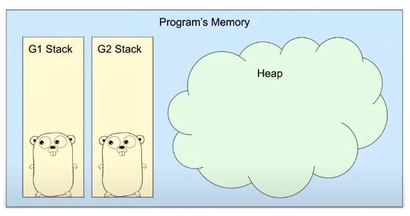
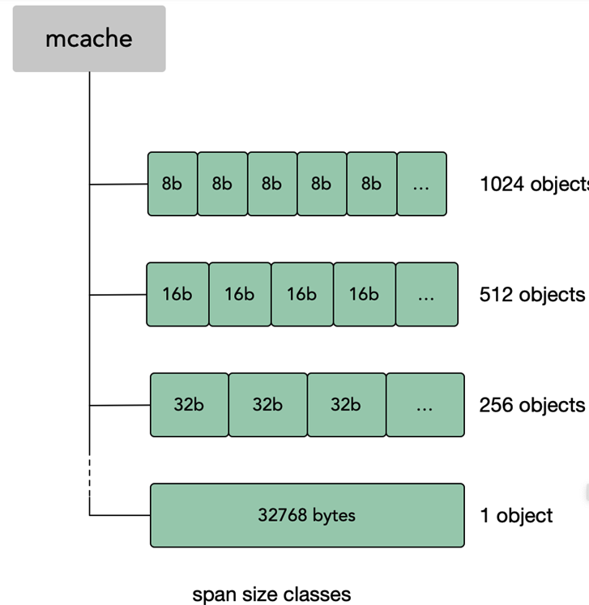

# Go Memory Allocate

In order to allow programmers to better focus on the implementation of business code, the Go language has added a **garbage collection** mechanism to automatically reclaim unused memory. 

Go has two places to allocate memory: **a global heap space** for dynamically allocating memory, and the other is each **goroutine's own stack** space.

### Stack memory

The memory in the stack area is generally allocated and released automatically by the compiler, which stores the input parameters of the function and local variables. These parameters will be created with the creation of the function and destroyed when the function returns. (via CPU push & release).

Stack memory is the simplest and most efficient way to allocate and reclaim. It is essentially a "linear allocation" of a continuous memory.

### Heap memory

The memory in the heap area is generally managed and allocated by the compiler and the engineer themselves, and released by the Runtime GC. Allocation on the heap must find **a large enough memory** to store new variable data. On subsequent frees, the garbage collector scans the heap space looking for objects that are no longer in use.
Anytime a value is shared outside the scope of a function’s stack frame, it will be placed (or allocated) on the heap.

Stack allocation is cheap, heap allocation is expensive

### So, are variables on the heap or on the stack?

The Go declaration syntax **does not mention the stack and the heap**, but leaves it to the Go compiler to decide where to allocate memory to ensure the correctness of the program.

The Go FAQ mentioned such an explanation:

> To put it in perspective, you don't need to know. Every variable in Go persists as long as there is a reference to it. The storage location of variables (heap or stack) has nothing to do with the semantics of the language.

The Go compiler will allocate local variables to functions in that function's stack frame if possible. But if the compiler cannot prove that the variable is unreferenced after the function returns, the compiler must allocate the variable on the heap that will be garbage collected to avoid dangling pointer errors. Also, if the local variable is very large, it might make more sense to store it on the heap rather than the stack.

In current compilers, a variable is a candidate for allocation on the heap if it is addressed. But basic **escape analysis** can identify variables that don't outlive the function's return value, and can therefore be allocated on the stack.

### Escape analysis

Determine whether to allocate it on the heap by checking whether the scope of the variable exceeds the stack where it is located", in which the behavior of "the scope of the variable exceeds the stack where it is located" is called escape. Escape analysis is static analysis in most languages: static code analysis at compile time determines whether a value can be allocated on the stack frame or needs to "escape" to the heap.

1. To reduce GC pressure, the variables on the stack are directly reclaimed by the system after the function exits, and they do not need to be marked and then cleared

2. Reduce memory fragmentation

3. Reduce the overhead of allocating heap memory and improve the running speed of the program

You can use the command **go build -gcflags -m** to find out whether variables escape to the heap.

Because the stack is more efficient than the heap and does not require GC, Go will allocate memory to the stack as much as possible.

When allocation to the stack may cause problems such as illegal memory access, the heap will be used. The main scenarios are:

1. When a value may be accessed after the function is called, the value is most likely to be allocated on the heap.
2. When the compiler detects that a value is too large, the value is allocated on the heap.
3. When compiling, the compiler doesn't know the size of the value (slice, map...) the value will be allocated on the heap.

### Stack size

When a Go application is running, each goroutine maintains its own stack area, which can only be used by itself and cannot be used by other goroutines. The initial size of the stack area is 2KB **(much smaller than the default thread stack of 2M under the x86_64 architecture)**. When the goroutine is running, the stack area will grow and shrink as needed. The default value of the maximum memory limit on the 64-bit system is 1GB.

1. v1.0 ~ v1.1 — the minimum stack memory space is 4KB
2. v1.2 — Increased minimum stack memory to 8KB
3. v1.3 — Use a contiguous stack instead of the previous version's segmented stack
4. v1.4 — Reduced minimum stack memory to 2KB (Contigous stacks)

### Memory Allocate

`TCMalloc `is short for `Thread Cache Malloc` ，Go use the way of TCMalloc. In general, there are two problems to be solved.

1. memory fragmentation: With the continuous application and release of memory, there will be a large number of fragments in the memory, reducing the usage of memory
2. big lock: All threads under the same process share the same memory space. When they apply for memory, they need to be **locked**. If there is no lock, there will be a problem that the same memory is accessed by two threads at the same time.

Let us start from some context.

1. **page**: Memory page, an 8K memory space. The memory application and release between Go and the operating system are all in page units.
2. **span**: memory block, one or more consecutive pages form a span.
3. **sizeclass**: space specification, each span has a sizeclass, marking how the pages in the span should be used.
4. **object**: object, used to store a variable data memory space, a span will be cut into a bunch of objects of equal size when it is initialized. Suppose the size of the object is 16B and the size of the span is 8K, then the page in the span will be initialized 8K / 16B = 512 objects.

#### Less than 16byte memory allocation

For objects smaller than 16 bytes (and without pointers), the Go language divides them into **tiny** objects. The main purpose of dividing tiny objects is to handle extremely small strings and individual escaped variables. Benchmarks on json show that using tiny objects reduces allocations by 12% and heap size by 20%. The tiny object will be put into a span with class 2.

1. First check to see if there is free space in the previously allocated element
2. If the current size to be allocated is not enough, for example, to allocate a size of 16 bytes, then it is necessary to find the next free element

The first step of tiny allocation is to try to use the allocated space of the previous element to save memory.

#### Less than 32kb memory allocation

When a small block of memory below 32kb is requested in the program, Go will allocate memory to the program from a local cache called **mcache**. Such a memory block is called mspan, which is the allocation unit when allocating memory to the program.

In Go's scheduler model, each thread M is bound to a processor P(As we said before), which can only process and **run at most one goroutine in a single granularity of time**, and each P is bound to a local cache mcache mentioned above. When memory allocation is required, the currently running goroutine looks for available mspans from the mcache. **There is no need to lock when allocating memory from the local mcache**, and this allocation strategy is more efficient.

If there is no free counterpart sizeclass mspan in **mcachce** when memory is allocated, Go also maintains an **mcentral** for each type of mspan, from which you can try to obtain resources.

**mcentral** is shared by all worker threads, and there is competition among multiple goroutines.

When **mcentral** has no free mspan, it will apply to **mheap**. When **mheap** has no resources, it will apply for new memory from the operating system. mheap is mainly used for memory allocation of large objects.

All **mcentral** collections are stored in **mheap**. The **arena** area in **mheap** is a real heap area, and 8KB is regarded as a page at runtime, and all objects initialized on the heap are stored in these memory pages. The runtime uses a two-dimensional runtime.heapArena array to manage all memory, and each runtime.heapArena will manage 64MB of memory.

If there is not enough space in the **arena** area, **runtime.mheap.sysAlloc** will be called to request more memory from the operating system.

#### More than 32kb memory allocation

Go cannot use the local cache mcache of the worker thread and the global central cache **mcentral** to manage memory allocation exceeding 32KB, so for those memory requests exceeding 32KB, the corresponding number of memory pages will be directly allocated from the **heap** (mheap) (per The page size is 8KB) to the program.