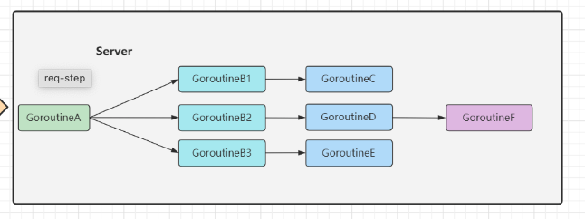
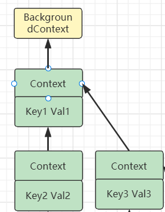

# How Context Works

Always, we have some questions about context.

1. ​    how to use context? Is it dangerous?
2. ​    how context works and change values?


**Context** can control the call of **Goroutine**'s operation, timeout, and cancellation method. 

Is there any other implementation method for these functions.？

 Of course, there are, controlling the operation of **Goroutine**, can be implemented through the **Select**+**Channel** mechanism, overtime control can also be implemented through the **Timer**, the cancellation method can also send a signal to the **Channel**, and the notification method can be exited.

 Since **Context** can be implemented, there are other ways to achieve it, why do I still have to **Context**?

 In some complicated scenarios, the control is very cumbersome through **Channel** and other methods, and using **Context** can easily implement the above functions.


### Global Variable

Let us see how to use **context** as global variable. fn1 create var i and fn2, fn3, fn4 use this.

```go
func fn1() {
	var i int

	fn2(i)
}

func fn2(i int) {
	fn3(i)
}

func fn3(i int) {
	fn4(i)
}

func fn4(i int) {
	print(i)
}
```


The code works fine, it's just a little bit verbose.
But if one day the requirements change, fn4 does not need the "state" of i anymore?
Then all code from fn4 to fn2 needs to remove the i state from the parameter declaration.
This butterfly effect code change is undoubtedly huge.
In order to solve the problem of "although only the parameter list of the last function was changed, all the functions of the whole project were changed in the end".
We can abstract the behavior of "obtaining state" separately, and each function obtains parameters from a unified "parameter center".
This eliminates the need to change function declarations when requirements change.
It can be done like this:

1. Create the parameter center object ctx.
2. Modify the function to declare ctx as a parameter.
3. Share the "state" i into ctx.
4. Get status from parameter center.


```go
type Context map[string]interface{}

func fn1() {
    var ctx = make(Context)
    ctx["i"] = 1

    fn2(ctx)
}

func fn2(ctx Context) {
    fn3(ctx)
}

func fn3(ctx Context) {
    fn4(ctx)
}

func fn4(ctx Context) {
    var i = ctx["i"].(int)
    print(i)
}
```

（In Java, we can use ThreadLocal.） 


The most common is the background HTTP/RPC Server.

In the Go server, usually every request will start several **goroutines** to work at the same time: some **go** to the database to get data, and some call the downstream interface to get related data, as shown in the following figure:



The client generally does not wait indefinitely, and will be requested to set a timeout period, such as 100ms.

For example, here GoroutineA consumes 80ms, GoroutineB3 consumes 30ms, and it has timed out, so the subsequent GoroutineCDEF does not need to be executed, and the client has returned after a timeout, so even if the server calculates the result, it is meaningless.

So here you can use Context to transmit timeout signals between multiple Goroutines.

At the same time, there are two benefits after introducing timeout control:

1) The client can return quickly to improve user experience
2) The server can reduce invalid calculations


### Context

In Go services, an independent **goroutine** is often used to process a request, but in this **goroutine**, other **goroutines** may be opened to perform some specific transactions, such as database, RPC, etc. At the same time, this group of **goroutines** may also need Common access to some special values, such as user token, request expiration time, etc. When a request times out, we hope that all **goroutines** related to this request can exit quickly to reclaim system resources.

Using it, you can easily pass specific values, cancellation signals, and deadlines to all goroutines involved in the request.

Context was introduced into the standard library in version 1.7 of Go. The main contents can be summarized as follows:

- 1 interface
  - Context
- 4 implementations
  - emptyCtx
  - cancelCtx
  - timerCtx
  - valueCtx
- 6 methods
  - background
  - TODO
  - WithCancel
  - With Deadline
  - With Timeout
  - WithValue


The core of the context package is the Context interface, whose structure is as follows:

```go
// A Context carries a deadline, a cancellation signal, and other values across
// API boundaries.
//
// Context's methods may be called by multiple goroutines simultaneously.
type Context interface {
   // Deadline returns the time when work done on behalf of this context
   // should be canceled. Deadline returns ok==false when no deadline is
   // set. Successive calls to Deadline return the same results.
   Deadline() (deadline time.Time, ok bool)

   // Done returns a channel that's closed when work done on behalf of this
   // context should be canceled. Done may return nil if this context can
   // never be canceled. Successive calls to Done return the same value.
   // The close of the Done channel may happen asynchronously,
   // after the cancel function returns.
   //
   // WithCancel arranges for Done to be closed when cancel is called;
   // WithDeadline arranges for Done to be closed when the deadline
   // expires; WithTimeout arranges for Done to be closed when the timeout
   // elapses.
   //
   // Done is provided for use in select statements:
   //
   //  // Stream generates values with DoSomething and sends them to out
   //  // until DoSomething returns an error or ctx.Done is closed.
   //  func Stream(ctx context.Context, out chan<- Value) error {
   //     for {
   //        v, err := DoSomething(ctx)
   //        if err != nil {
   //           return err
   //        }
   //        select {
   //        case <-ctx.Done():
   //           return ctx.Err()
   //        case out <- v:
   //        }
   //     }
   //  }
   //
   // See https://blog.golang.org/pipelines for more examples of how to use
   // a Done channel for cancellation.
   Done() <-chan struct{}

   // If Done is not yet closed, Err returns nil.
   // If Done is closed, Err returns a non-nil error explaining why:
   // Canceled if the context was canceled
   // or DeadlineExceeded if the context's deadline passed.
   // After Err returns a non-nil error, successive calls to Err return the same error.
   Err() error

   // Value returns the value associated with this context for key, or nil
   // if no value is associated with key. Successive calls to Value with
   // the same key returns the same result.
   //
   // Use context values only for request-scoped data that transits
   // processes and API boundaries, not for passing optional parameters to
   // functions.
   //
   // A key identifies a specific value in a Context. Functions that wish
   // to store values in Context typically allocate a key in a global
   // variable then use that key as the argument to context.WithValue and
   // Context.Value. A key can be any type that supports equality;
   // packages should define keys as an unexported type to avoid
   // collisions.
   //
   // Packages that define a Context key should provide type-safe accessors
   // for the values stored using that key:
   //
   //     // Package user defines a User type that's stored in Contexts.
   //     package user
   //
   //     import "context"
   //
   //     // User is the type of value stored in the Contexts.
   //     type User struct {...}
   //
   //     // key is an unexported type for keys defined in this package.
   //     // This prevents collisions with keys defined in other packages.
   //     type key int
   //
   //     // userKey is the key for user.User values in Contexts. It is
   //     // unexported; clients use user.NewContext and user.FromContext
   //     // instead of using this key directly.
   //     var userKey key
   //
   //     // NewContext returns a new Context that carries value u.
   //     func NewContext(ctx context.Context, u *User) context.Context {
   //        return context.WithValue(ctx, userKey, u)
   //     }
   //
   //     // FromContext returns the User value stored in ctx, if any.
   //     func FromContext(ctx context.Context) (*User, bool) {
   //        u, ok := ctx.Value(userKey).(*User)
   //        return u, ok
   //     }
   Value(key any) any
}
```


#### 4 implementations

##### emptyCtx

```go
type emptyCtx int

func (*emptyCtx) Deadline() (deadline time.Time, ok bool) {
	return
}

func (*emptyCtx) Done() <-chan struct{} {
	return nil
}

func (*emptyCtx) Err() error {
	return nil
}

func (*emptyCtx) Value(key interface{}) interface{} {
	return nil
}

var (
    background = new(emptyCtx)
    todo       = new(emptyCtx) 
)

func Background() Context {
    return background
}
func TODO() Context {
	return todo
}
```

It has no function. Judging from the source code, **context.Background** and **context.TODO** are just aliases for each other, there is not much difference, but slightly different in usage and semantics:

- **context.Background** is the default value of the context, all other contexts should be derived from it;
- context.TODO should only be used when not sure which context should be used;

In most cases, if the current function does not have a **context** as an input parameter, we will use **context.Background** as the initial context to pass down.


##### cancelCtx


```go
type cancelCtx struct {
    // have a field Context
	Context

	mu       sync.Mutex            // protects following fields
	done     atomic.Value          // of chan struct{}, created lazily, closed by first cancel call
	children map[canceler]struct{} // set to nil by the first cancel call
	err      error                 // set to non-nil by the first cancel call
}


type canceler interface {
	cancel(removeFromParent bool, err error)
	Done() <-chan struct{}
}

// create cancelCtx
func WithCancel(parent Context) (ctx Context, cancel CancelFunc) {
	if parent == nil {
		panic("cannot create context from nil parent")
	}
	c := newCancelCtx(parent)
	propagateCancel(parent, &c)
	return &c, func() { c.cancel(true, Canceled) }
}
func newCancelCtx(parent Context) cancelCtx {
	return cancelCtx{Context: parent}
}
```


At the same time, propagateCancel will build the association between parent and child contexts to form a tree structure. When the parent context is canceled, the child context will also be cancelled:

```go
func propagateCancel(parent Context, child canceler) {
	done := parent.Done()
	if done == nil {
		return // parent is never canceled
	}
	select {
	case <-done:
		// parent is already canceled
		child.cancel(false, parent.Err())
		return
	default:
	}
	if p, ok := parentCancelCtx(parent); ok {
		p.mu.Lock()
		if p.err != nil {
			// parent has already been canceled
			child.cancel(false, p.err)
		} else {
			if p.children == nil {
				p.children = make(map[canceler]struct{})
			}
			p.children[child] = struct{}{}
		}
		p.mu.Unlock()
	} else {
		atomic.AddInt32(&goroutines, +1)
		go func() {
			select {
			case <-parent.Done():
				child.cancel(false, parent.Err())
			case <-child.Done():
			}
		}()
	}
}

```

In total, the above functions relate to three different cases of the parent **context**:

1) When **parent.Done()** == nil, that is, the parent will not trigger the cancellation event, the current function will return directly;
2) When the child's inheritance chain contains a **context** that can be canceled, it will determine whether the parent has triggered the cancellation signal;
  1) If it has been canceled, the child will be canceled immediately;
  2) If not canceled, the child will be added to the parent's children list, waiting for the parent to release the cancel signal;
3) When the parent context is a developer-defined type, implements the context.Context interface, and returns a non-empty pipeline in the Done() method;
  Run a new Goroutine while listening to the parent.Done() and child.Done() Channels;
  call child.cancel to cancel the child context when parent.Done() is closed;


##### timerCtx

TimerCtx not only inherits related variables and methods by embedding **cancelCtx**, but also implements the function of timing cancellation through the held timer and deadline:

```go
type timerCtx struct {
	cancelCtx
	timer *time.Timer // Under cancelCtx.mu.

	deadline time.Time
}

func (c *timerCtx) Deadline() (deadline time.Time, ok bool) {
	return c.deadline, true
}

func (c *timerCtx) cancel(removeFromParent bool, err error) {
	c.cancelCtx.cancel(false, err)
	if removeFromParent {
		removeChild(c.cancelCtx.Context, c)
	}
	c.mu.Lock()
	if c.timer != nil {
		c.timer.Stop()
		c.timer = nil
	}
	c.mu.Unlock()
}

func WithTimeout(parent Context, timeout time.Duration) (Context, CancelFunc) {
	return WithDeadline(parent, time.Now().Add(timeout))
}


func WithDeadline(parent Context, d time.Time) (Context, CancelFunc) {
	if parent == nil {
		panic("cannot create context from nil parent")
	}
	if cur, ok := parent.Deadline(); ok && cur.Before(d) {
		// The current deadline is already sooner than the new one.
		return WithCancel(parent)
	}
	c := &timerCtx{
		cancelCtx: newCancelCtx(parent),
		deadline:  d,
	}
	propagateCancel(parent, c)
	dur := time.Until(d)
	if dur <= 0 {
		c.cancel(true, DeadlineExceeded) // deadline has already passed
		return c, func() { c.cancel(false, Canceled) }
	}
	c.mu.Lock()
	defer c.mu.Unlock()
	if c.err == nil {
		c.timer = time.AfterFunc(dur, func() {
			c.cancel(true, DeadlineExceeded)
		})
	}
	return c, func() { c.cancel(true, Canceled) }
}
```


##### valueCtx

```go
type valueCtx struct {
	Context
	key, val interface{}
}

func WithValue(parent Context, key, val interface{}) Context {
	if parent == nil {
		panic("cannot create context from nil parent")
	}
	if key == nil {
		panic("nil key")
	}
	if !reflectlite.TypeOf(key).Comparable() {
		panic("key is not comparable")
	}
	return &valueCtx{parent, key, val}
}

func (c *valueCtx) Value(key interface{}) interface{} {
	if c.key == key {
		return c.val
	}
	return c.Context.Value(key)
}
```

The process of getting the value is actually a recursive search process. If the key is consistent with the value stored in the current ctx, it will be returned directly, if not, it will be searched in the parent. Finally find the root node (usually emptyCtx), directly return a nil. So when using the Value method, it is necessary to judge whether the result is nil.




#### Advice

1. Do not store Contexts inside a struct type; instead, pass a Context explicitly to each function that needs it. The Context should be the first parameter, typically named ctx.
2. Do not pass a nil Context, even if a function permits it. Pass context.TODO if you are unsure about which Context to use.
3. Use context Values only for request-scoped data that transits processes and APIs, not for passing optional parameters to functions.
4. The same Context may be passed to functions running in different goroutines; Contexts are safe for simultaneous use by multiple goroutines.


#### Reference

1. https://pkg.go.dev/context
