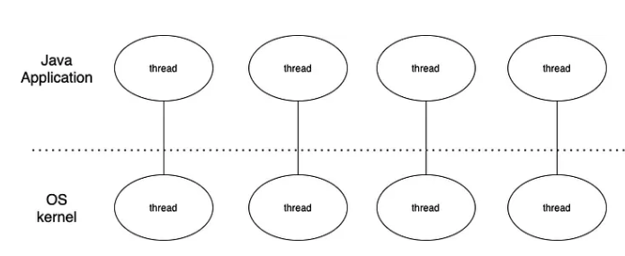
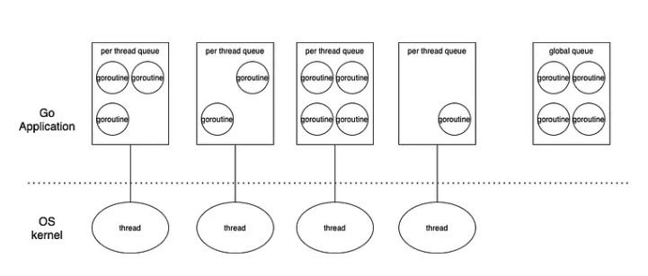
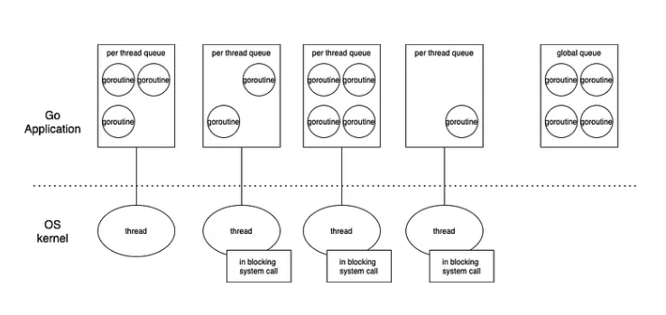
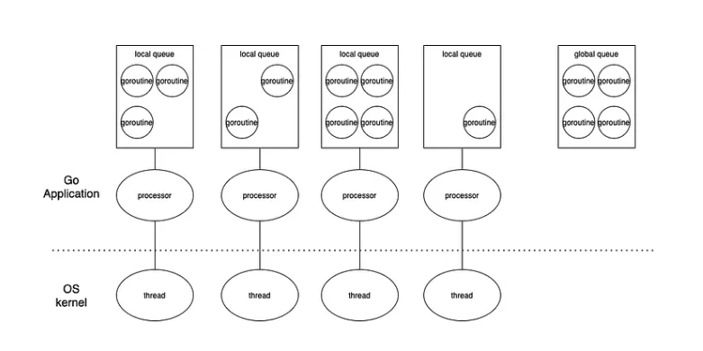
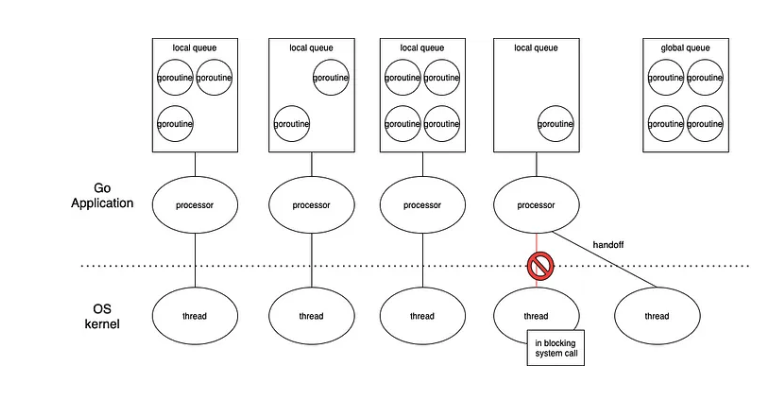

# How Goroutine Works

Let us start with some questions about Goroutine, 

1. Single-core CPU, open two Goroutines, one of which has an infinite loop, what will happen?
2. Processes and threads have IDs, why doesn't Goroutine have an ID?
3. How much is the right number of Goroutines, will it affect GC and scheduling?
4. What are the Goroutine leaks?
5. What can cause a Goroutine to hang?


At first, let us see how Java create threads (In Java 19, they add a new feature called Virtual Threads, this thing just works like Goroutine, so we just compare Go with old version Java).


### Java Thread

Java thread just use native thread provided by OS，and it related on OS  to scheduler.



Here is the Java code for 1000 threads. 

```java
public static void main(String []args) throws InterruptedException {
    for (int i = 0 ;i<1000;i++){
        new Thread(()->{
            try {
                Thread.sleep(100000000);
            } catch (InterruptedException e) {
                e.printStackTrace();
            }
        }).start();
    }
    Thread.sleep(100000000);
}
```

It will actually create 1000 threads (Java need some more threads, like for GC)

```
weiwensnagsang:~$ ps -T 100000 | wc -l1018
1018
```


In the best case, OS thread switching also requires the following operations,

1. CPU registers need to be saved and loaded.
2. The code of the system scheduler needs to be executed.
3. The CPU pipeline needs to be cleared.


The Java has been trying to optimize this problem. Because if a language wants to support high concurrency, the loss of thread switching is a serious bottleneck, and it will greatly drag down the corresponding time of the system as a whole.

In some extreme cases, the CPU may only spend 30% of its time on work, and the remaining 70% of its time is spent on creating, maintaining, and switching threads.


### Goroutine


Compared with Java using native threads and relying on the native scheduler of the OS to schedule, goroutine implements its own scheduler and schedules goroutines to execute between fixed threads by itself:




Here is the Go code for 1000 threads. 

```go
func doSomething() {
	time.Sleep(10 * time.Minute)
}

func main() {
	for i := 0; i < 100000; i++ {
		go doSomething()
	}

	time.Sleep(10 * time.Minute)

}
```


Thread will switch to another thread approximately every 10ms of executing a goroutine. And the priority order of thread picking goroutine is

1. goroutines in each thread's own queue
2. goroutines in the global queue
3. Stealing from other thread's queue (work-stealing)


How many threads for this Go code?

```
5
```


So far so good, but what if the thread gets stuck with a blocking system call (ex. reading a large file)? For example, in the figure below, there are three goroutines reading large files through the io system call. At this time, all goroutines will only rely on one thread for execution, which greatly reduces the utilization rate of the core.




In order to solve this problem, golang separates another layer of process between thread and goroutine as follows:




When a thread is blocked by the system call block, golang will create a new thread to take over the work of the processor, while the original thread will continue to execute the system call.




If we open 1000 goroutines to read a large file test, when Golang frequently opens goroutines to call blocking system calls, the number of threads created will probably be between **100 and 200**, which also shows that in some extreme cases, the concurrency of Go may It will degenerate to Java using native thread.

This is what we called GPM.


### GMP

1. G: go coroutine (Goroutine), each **go** keyword will create a coroutine.

2. M: Machine thread. Kernel-level thread, all G must be placed on M to run.

3. P: schedules G to M, and maintains a queue that stores all G that needs to be scheduled.


The Goroutine scheduler P and the OS scheduler are combined through M, each M represents a kernel thread, and the OS scheduler is responsible for assigning the kernel thread to the core of the CPU for execution


#### Main function

We can start with a very speical Goroutine: g0. G0 is for main function so it means main is also a goroutine.

```go
package main

import "fmt"

func main() {
    fmt.Println("Hello world")
}
```

In the code, GMP works like this.

1. The runtime creates the initial thread m0 and goroutine g0, and associates the two.
2. Scheduler initialization: Initialize m0, stack, garbage collection, and create and initialize a P-list of GOMAXPROCS P's.
3. The main function in the sample code is main.main, and there is also a main function in the runtime——runtime.main. After the code is compiled, runtime.main will call main.main. When the program starts, a goroutine will be created for runtime.main, called Let it be the main goroutine, and then add the main goroutine to the local queue of P.
4. Start m0, m0 has been bound to P, will get G from P's local queue, and get the main goroutine.
5. G owns the stack, and M sets the operating environment according to the stack information and scheduling information in G
6. M run G
7. G exits, returns to M again to obtain a runnable G, and repeats until main.main exits, runtime.main executes Defer and Panic processing, or calls runtime.exit to exit the program.


The starter code for g0 and m0 is in this file: /go/src/runtime/asm_amd64.s. 

```assembly
TEXT runtime·rt0_go(SB),NOSPLIT|NOFRAME|TOPFRAME,$0
   // copy arguments forward on an even stack
   // Code to handle command line arguments
   MOVQ   DI, AX    // argc
   MOVQ   SI, BX    // argv
   SUBQ   $(5*8), SP    // 3args 2auto // Expand the stack by 40 bytes,
   ANDQ   $~15, SP      // adjust to 16 byte alignment
   MOVQ   AX, 24(SP)    //argc is placed at SP + 24 bytes
   MOVQ   BX, 32(SP)    //argc is placed at SP + 32 bytes

   //Start to initialize g0, runtime·g0 is a global variable, the global variable will be saved in the data area of the process memory space, the following will introduce the code data and code in the elf binary file global variable method
   // The stack of g0 is allocated from the process stack memory area, and g0 occupies about 64k in size.
   // create istack out of the given (operating system) stack.
   // Start to initialize the three fields stackguard0, stackguard1, stack of the g0 object
   MOVQ   $runtime·g0(SB), DI
   LEAQ   (-64*1024)(SP), BX
   MOVQ   BX, g_stackguard0(DI)
   MOVQ   BX, g_stackguard1(DI)
   MOVQ   BX, (g_stack+stack_lo)(DI)
   MOVQ   SP, (g_stack+stack_hi)(DI)

   ...
   
   // Code for how m0 and g0 connected.
   LEAQ	runtime·m0+m_tls(SB), DI
	 CALL	runtime·settls(SB)

	// store through it, to make sure it works
	get_tls(BX) //tls: Thread Local Storage
	MOVQ	$0x123, g(BX)
	MOVQ	runtime·m0+m_tls(SB), AX
	CMPQ	AX, $0x123
	JEQ 2(PC)
	CALL	runtime·abort(SB)
ok:
	// set the per-goroutine and per-mach "registers"
	get_tls(BX)
	LEAQ	runtime·g0(SB), CX
	MOVQ	CX, g(BX)
	LEAQ	runtime·m0(SB), AX

	// save m->g0 = g0
	MOVQ	CX, m_g0(AX)
	// save m0 to g0->m
	MOVQ	AX, g_m(CX)
```


#### The keyword go

Another way to create Goroutine is use **go**

If we generate the SSA to see how golang implememt go, we can see this,

```
CALL runtime.newproc(SB)
```

In runtime.newproc, a new stack space will be created, the 12 bytes of the stack parameter will be copied to the new stack space and the stack pointer will point to the parameter. 

The thread state at this time is a bit like when the CPU is deprived by the scheduler, the registers PC and SP will be saved in a structure struct G similar to the process control block. f is stored in the entry field of struct G, and the scheduler resumes the running of goroutine later, and the new thread will start to execute from f. The difference from the implementation in C mentioned above is that no auxiliary structure is used, and runtime.newproc is actually a help function.

so we can say this,

```
go f(args) = runtime.newproc(siz int32, fn *funcval)
```


#### Answers

1. **Single-core CPU, open two Goroutines, one of which has an infinite loop, what will happen?**

   - In this case, one of the Goroutines has an infinite loop, which means it will never yield the CPU to the other Goroutine. As a result, the other Goroutine may not be able to execute until the infinite loop is interrupted. This can lead to a situation where the infinite loop dominates the CPU and the other Goroutine may effectively be "starved" of CPU time.

     However, the actual behavior will depend on a number of factors, including the specific code being executed, the workload on the CPU, and the scheduling algorithm used by the Go runtime. In general, it's not recommended to have Goroutines with infinite loops, as they can lead to unpredictable behavior and can be difficult to debug. It's usually better to use channels, timeouts, or other mechanisms to control the behavior of Goroutines and ensure that they don't monopolize the CPU.

2. **Processes and threads have IDs, why doesn't Goroutine have an ID?**

   - While it is true that goroutines have unique identifiers, the Go runtime chooses not to expose them to the user in order to encourage a more high-level and declarative approach to concurrency.

3. **How much is the right number of Goroutines, will it affect GC and scheduling?**

   - Similarly, if too many Goroutines are created and the Go scheduler needs to frequently switch between them, this can increase overhead and negatively impact performance. In general, it is recommended to use a smaller number of long-running Goroutines rather than a larger number of short-lived ones, as this can reduce the overhead of context switching.

     Ultimately, the right number of Goroutines will depend on the specific requirements of the program, and it may require some experimentation and tuning to find the optimal balance between parallelism, memory usage, and scheduling overhead.

4. **What are the Goroutine leaks?**

   - Goroutine leaks can be caused by a number of different factors, including:

     1. Unbounded channel operations: If a Goroutine is waiting on a channel that is never closed or has no buffer, it will block indefinitely, causing a Goroutine leak.
     2. Forgotten timers or tickers: If a Goroutine is created to handle a timer or ticker event but the timer or ticker is not stopped or the Goroutine is not properly cleaned up, it can result in a Goroutine leak.
     3. Failure to use WaitGroups: If a Goroutine is launched as part of a group of Goroutines but is not properly added to a WaitGroup, it can continue to run even after the main program has exited.
     4. Not using the defer keyword: If the Goroutine is created inside a function and the function returns before the Goroutine completes, it will be orphaned and continue to run indefinitely.

     To avoid Goroutine leaks, it is important to ensure that all Goroutines are properly cleaned up after they complete their tasks. This can be achieved by using mechanisms such as channels, timers, WaitGroups, and the defer keyword to properly manage the lifecycle of Goroutines.

5. **What can cause a Goroutine to hang?**

   - A Goroutine can hang or become deadlocked if it gets into a state where it is waiting for a resource that is not available or if there is a circular dependency between two or more Goroutines. Here are some common causes of Goroutine hang:

     1. Channel blocking: A Goroutine that is waiting for data on an unbuffered channel can become deadlocked if no other Goroutine is sending data on that channel, or if the sending Goroutine is also blocked waiting for the receiver to read the data.
     2. Mutex contention: If multiple Goroutines are waiting to acquire the same mutex lock, they can become deadlocked if the lock is not released by the currently holding Goroutine.
     3. Circular dependencies: If two or more Goroutines are waiting for each other to complete before continuing their own execution, they can become deadlocked.
     4. Incorrect use of synchronization primitives: Incorrect use of synchronization primitives like WaitGroups, Mutex, RWMutex, or Cond can cause deadlocks.
     5. Incomplete error handling: If a Goroutine fails to handle an error condition, it can hang or become deadlocked while waiting for a resource that will never be available.

     To avoid Goroutine hang, it is important to use proper synchronization primitives and ensure that all Goroutines handle errors and resources correctly. Also, the use of tools like `go vet`, `go race detector`, and `go test` can help to identify potential deadlocks in a Go program.