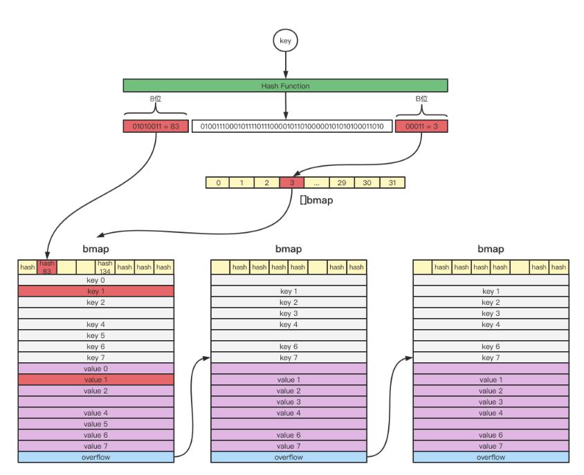
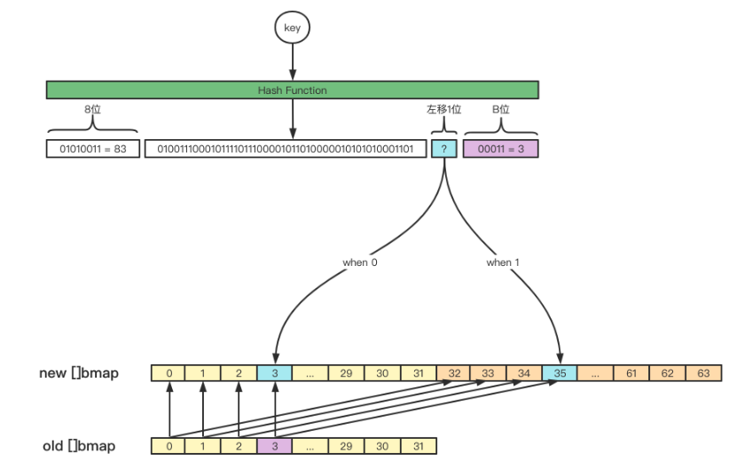
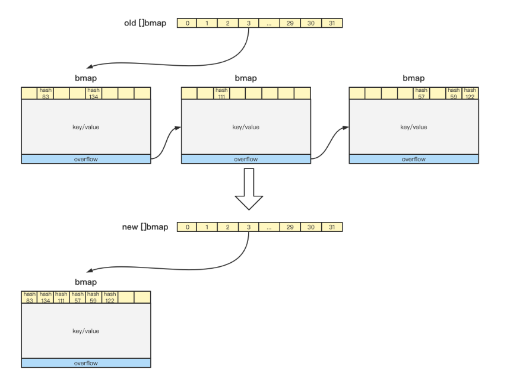

# Map In Go

Go build a much more simple Map, simple but effective.

1. How map works?
2. Why is Go map not thread-safe?
2. Why is the load factor of Go map 6.5?
3. Why does the key of the map have to be of a comparable type?
5. How can we copy a map in Go?
6. Can we override the hashcode()?


The code for map is in src/runtime/map.go. The realization principle is a variant of the zipper method. To be honest, there is nothing new, so we simply analyze it from the four behaviors of init, get, set, and expansion.


```go
// A header for a Go map.
type hmap struct {
	// Note: the format of the hmap is also encoded in cmd/compile/internal/gc/reflect.go.
	// Make sure this stays in sync with the compiler's definition.
	count     int // # live cells == size of map.  Must be first (used by len() builtin)
	flags     uint8
	B         uint8  // log_2 of # of buckets (can hold up to loadFactor * 2^B items)
	noverflow uint16 // approximate number of overflow buckets; see incrnoverflow for details
	hash0     uint32 // hash seed

	buckets    unsafe.Pointer // array of 2^B Buckets. may be nil if count==0.
	oldbuckets unsafe.Pointer // previous bucket array of half the size, non-nil only when growing
	nevacuate  uintptr        // progress counter for evacuation (buckets less than this have been evacuated)

	extra *mapextra // optional fields
}

type bmap struct {
  topbits  [8]uint8
  keys     [8]keytype
  values   [8]valuetype
  pad      uintptr
  overflow uintptr
}
```


### Make a map


```go
// makemap implements Go map creation for make(map[k]v, hint).
// If the compiler has determined that the map or the first bucket
// can be created on the stack, h and/or bucket may be non-nil.
// If h != nil, the map can be created directly in h.
// If h.buckets != nil, bucket pointed to can be used as the first bucket.

func makemap(t *maptype, hint int, h *hmap) *hmap {
	mem, overflow := math.MulUintptr(uintptr(hint), t.bucket.size)
	if overflow || mem > maxAlloc {
		hint = 0
	}

	// initialize Hmap
	if h == nil {
		h = new(hmap)
	}
	h.hash0 = fastrand()

	// Find the size parameter B which will hold the requested # of elements.
	// For hint < 0 overLoadFactor returns false since hint < bucketCnt.

	B := uint8(0)
	for overLoadFactor(hint, B) {
		B++
	}
	h.B = B

	// allocate initial hash table
	// if B == 0, the buckets field is allocated lazily later (in mapassign)
	// If hint is large zeroing this memory could take a while.
	
	if h.B != 0 {
		var nextOverflow *bmap
		h.buckets, nextOverflow = makeBucketArray(t, h.B, nil) // memory for Buckets
		if nextOverflow != nil {
			h.extra = new(mapextra)
			h.extra.nextOverflow = nextOverflow
		}
	}

	return h
}
```


### Get




Steps are as follows:

- Taking the 64-bit operating system as an example, the original key is mapped into a 64-bit binary through the Hash function.
- The last B bit corresponds to the position of the **bmap**, and the corresponding **bmap** is found from **[]bmap**.
- The first 8 digits correspond to the tophash of the key, and the search starts from the **bmap** located in step 2. First, it will compare whether the top-level tophash of the **bmap** is the same as that of the original key. If they are not the same, skip the comparison to the next one; if they are the same, further compare whether the key is the same.
- If the current **bmap** is compared and the target key is not matched, and **overflow** is not empty, then continue to compare from the next **bmap** pointed to by **overflow**.


### Set

Without considering the **expansion**, the basic logic of map **get** and map **set** is consistent. 

1. First, follow the map get method to locate the bmap through the last B bit, and quickly compare the tophash through the first 8 bits. 
2. When the key does not exist in the map, the first free tophash in the **bmap** will be recorded and the key will be inserted. 
3. When the key exists in the map, the value of the key will be updated.


### Expansion


There are two ways for map to trigger expansion:

1. If the load factor (the ratio of length to capacity) of the map exceeds the threshold, the map is considered unable to bear more keys at this time, and needs to be expanded by 2 times.
2. There is a situation in the map that some bmaps contain too many overflows. At this time, the map will think that the local bmaps can be densely arranged by tophash, so that the number of overflows is less.




