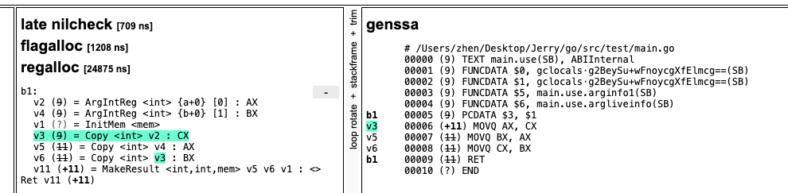

# How to Swap the Values of Two Variables


Just this.

```go
a := 1
b := 2
a, b, a = b, a, b
```


#### Why?

See how code actually works,

```HTML
main.go:5   0x454b9b 48c744241801000000   mov qword ptr [rsp+0x18], 0x1  // a:=1
main.go:6   0x454ba4 48c744241002000000   mov qword ptr [rsp+0x10], 0x2  // b:=2
main.go:7   0x454bad 488b442418           mov rax, qword ptr [rsp+0x18]
main.go:7   0x454bb2 4889442428           mov qword ptr [rsp+0x28], rax  // aTemp := a
main.go:7   0x454bb7 488b442410           mov rax, qword ptr [rsp+0x10]
main.go:7   0x454bbc 4889442420           mov qword ptr [rsp+0x20], rax  // bTemp := b
main.go:7   0x454bc1 488b442410           mov rax, qword ptr [rsp+0x10]
main.go:7   0x454bc6 4889442418           mov qword ptr [rsp+0x18], rax  // a = b
main.go:7   0x454bcb 488b442428           mov rax, qword ptr [rsp+0x28]
main.go:7   0x454bd0 4889442410           mov qword ptr [rsp+0x10], rax  // b = aTemp
main.go:7   0x454bd5 488b442420           mov rax, qword ptr [rsp+0x20]
main.go:7   0x454bda 4889442418           mov qword ptr [rsp+0x18], rax  // a = bTemp
```


This code create 2 more variables [rsp+0x28] as aTemp, [rsp+0x20] as bTemp.

The principle of the two value exchange operations here is to store the values of the two assigned variables in **temporary variables**, and then use the temporary variables to assign values. So the order of assignment in this example has no effect on the result, and the result is still a = 2, b = 1.

There is no need to write the swap function and then inline it like C language, which is equivalent to leaving the dirty work to the compiler.

The code actually like this.

```
a := 1
b := 2
FIND a, b, a = b, a, b // Need use a and b to set values.
aTemp = a
bTemp = b
a, b, a = bTemp, aTemp, bTemp
```


#### What's more

If we want to dig out more about how this code works. We need know some context about how Go Compiler works.

Complier Steps,

1. Parsing

2. Type checking

3. IR construction (intermediate representation, "noding")

4. Middle end

5. Walk

6. Generic SSA (Static Single Assignment)

7. Generating machine code


In simple terms, before the code written in Go language is generated into machine code, it needs to first generate intermediate code (IR) with SSA characteristics. The most important feature of this form of IR code is that variables are always defined before they are used and each variable is assigned only once.

IR is a crucial step because the optimization of Go language takes place there, including some syntax transformations.

For example, 

```go
package main

func main() {
   a := 1
   b := 2
   use(a, b)
}

func use(a int, b int) (int, int) {
   a, b = b, a
   return a, b
}
```

Use this commad to generate SSA and show how go compiler works. 

```
GOSSAFUNC="use" go build main.go
```

We can see the result, The compiler insert a CX as a temp values.



#### Reference

1. https://github.com/golang/go/tree/master/src/cmd/compile
